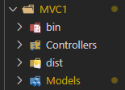

## 1. Container com projeto MVC
<br>
Este projeto tem por objetivo criar um projeto MVC, criar sua imagem e subir em um container utilizando o Docker.

**Requisitos**: .NET SDK 5.0 ou 6.0; Docker;

Obs.: esse exemplo foi feito com .Net 6.0 (recomendo utilizar a mesma versão, para quando chegar ao MVC2).

<br>

----

## 2. Sumário
<br>

- [1. Container com projeto MVC](#1-container-com-projeto-mvc)
- [2. Sumário](#2-sumário)
- [3. Criando o projeto .Net 5.0 ou .Net 6.0](#3-criando-o-projeto-net-50-ou-net-60)
- [4. Criando modelo de dados](#4-criando-modelo-de-dados)
- [5. Implementar o padrão Repository](#5-implementar-o-padrão-repository)
- [6. Ajustar a classe Startup (.Net 5.0)](#6-ajustar-a-classe-startup-net-50)
- [7. Ajustar a classe Program.cs (.Net 6.0)](#7-ajustar-a-classe-programcs-net-60)
- [8. Ajustar o HomeController.cs](#8-ajustar-o-homecontrollercs)
- [9. Ajustar Index.cshtml](#9-ajustar-indexcshtml)
- [10. Publicar a aplicação](#10-publicar-a-aplicação)
- [11. Criando arquivo Dockerfile](#11-criando-arquivo-dockerfile)
- [12. Gerando a imagem](#12-gerando-a-imagem)
- [13. Criando o container](#13-criando-o-container)
- [14. Iniciando o container](#14-iniciando-o-container)
- [15. Publicando a imagem](#15-publicando-a-imagem)

----
## 3. Criando o projeto .Net 5.0 ou .Net 6.0
<br>

Dentro do diretório, no nosso exemplo MVC1, na CLI (linha de comando), digite:

    dotnet new mvc

Esse comando vai restaurar os padrões de um projeto MVC, criando todos os arquivos iniciais do projeto.

<br>

-----

## 4. Criando modelo de dados
<br>
No diretório MVC1 > Models criar a classe Produto.cs

```c#
    public class Produto
    {
        public Produto(string nome=null, string categoria=null, decimal preco=0)
        {
            this.Nome = nome;
            this.Categoria = categoria;
            this.Preco = preco;

        }
        public int ProdutoId { get; set; }
        public string Nome { get; set; }
        public string Categoria { get; set; }
        public decimal Preco { get; set; }
    }
```
----

## 5. Implementar o padrão Repository
<br>
No diretorio MVC1 > Models criar a interface IRepository.cs

``` c#
    public interface IRepository
    {
         IEnumerable<Produto> Produtos {get;}
    }
```

e no mesmo diretório criar a classe TesteRepository.cs

``` c#
public class TesteRepository : IRepository
    {
        private static Produto[] produtos = new Produto[]
        {
            new Produto { ProdutoId=10, Nome="Caneta", Categoria="Material", Preco=2.00M },
            new Produto { ProdutoId=20, Nome="Borracha", Categoria="Material", Preco=1.50M },
            new Produto { ProdutoId=30, Nome="Estojo", Categoria="Material", Preco=3.00M }
        };

        public IEnumerable<Produto> Produtos {get => produtos; }
    }
```
----

## 6. Ajustar a classe Startup (.Net 5.0)
<br>
Adicionar a linha abaixo no Startup.cs, dentro do ConfigureServices

    services.AddTransient<IRepository, TesteRepository>();

Ex.:

```c#
public void ConfigureServices(IServiceCollection services)
{
    ...

    services.AddTransient<IRepository, TesteRepository>(); //adicionar esta linha

    ...
}
```

----

## 7. Ajustar a classe Program.cs (.Net 6.0)
<br>
No .Net 6.0 não há a classe Startup.cs, a configuração é feita diretamento no Program.cs, logo abaixo do comentário "Add services to the container."

Ex.:

```c#
var builder = WebApplication.CreateBuilder(args);

// Add services to the container.
builder.Services.AddControllersWithViews();
builder.Services.AddTransient<IRepository, TesteRepository>(); //Adicionar esta linha

...

```
A linha acrescentada injeta o serviço.

**AddTransient<>()** - serviço criado a cada vez que for solicitado.

----

## 8. Ajustar o HomeController.cs
<br>
Injetar o repositório no construtor do controlador e obter instância para retornar os produtos.

Diretório MVC1 > Controllers > HomeController.cs

```c#
public class HomeController : Controller
{
    private IRepository repository;
    private string message;

    public HomeController(IRepository repo, IConfiguration config)
    {
        this.repository = repo;
        message = config["MESSAGE"] ?? "ASPNET Core MVC - Docker";
    }

    public IActionResult Index()
    {
        ViewBag.Message = message;
        return View(repository.Produtos);
    }
}
```

Você pode remover o construtor e as ações existentes no HomeController e substituir pelo código acima.

---

## 9. Ajustar Index.cshtml
Alterações para mostrar os produtos a partir da HomeConmtroller.cs

Diretório: MVC1 > Views > Home > Index.cshtml

```c#
@model IEnumerable<MVC1.Models.Produto> @*adiciona model de produto *@

@{
    ViewData["Title"] = "Home Page";
}

<div class="text-center">
    <h1 class="display-4">@ViewBag.Message</h1>
    <table class="table table-sm table-struped">
        <thead>
            <tr>
                <th>ID</th>
                <th>Nome</th>
                <th>Categoria</th>
                <th>Preço</th>
            </tr>
        </thead>
        @foreach(var prod in Model) @*Laço de repetição para exibir Id, Nome, Categoria e Preco *@
        {
            <tr>
                <td>@prod.ProdutoId</td> 
                <td>@prod.Nome</td>
                <td>@prod.Categoria</td>
                <td>@prod.Preco</td>
            </tr>
        }
    </table>
</div>
```
---

## 10. Publicar a aplicação
<br>
Esse procedimento vai compilar o aplicativo e publicar os arquivos resultantes em uma pasta.

Utilizar o comando:

    dotnet publish --configuration Release --output dist

**--configuration Release** - Indica que será utilizado o modo release, usado na produção.

**--output dist** - Especifica que o projeto compilado será copiado para uma pasta dist.

Após será criada a pasta dist no diretório MVC1

<center>



</center>

----

## 11. Criando arquivo Dockerfile
<br>

Crie um arquivo chamado **DockerFile**, no diretorio MVC1, com o seguinte conteúdo:

```docker
FROM mcr.microsoft.com/dotnet/aspnet:6.0 # Definir imagem base
LABEL version="1.0.1" description="Aplicação Aspnet Core MVC" # Definir iformações para imagem
COPY dist /app #definir pasta de trabalho /app
WORKDIR /app # copiar os arquivos pasta /dist para pasta /app 
EXPOSE 80/tcp # Expor a porta 80 no container e definir em qual porta o servidor vai atender
ENTRYPOINT ["dotnet","MVC1.dll"] # Definir poto de entrada da aplicação executa o comando dotnet MVC1.dll
```

**Importante!**

Se estiver usando o .Net 5.0 no projeto mvc, altere no Dockerfile a linha 1, para usar a versão 5.0:

```docker
FROM mcr.microsoft.com/dotnet/aspnet:5.0 # Utiliza a versão 5.0
```

----

## 12. Gerando a imagem
<br>

Utilize o comando docker build para ciar a imagem que usaremos no container.

    docker build -t mvc1:1.0 .

É importante não se esquecer do " . ", pois ele é a instrução para buscar o Dockerfile no diretório atual.

No fim do processo, você pode verificar a imagem criada usando o `docker images`

<center>


</center>

----

## 13. Criando o container
<br>

Utilize o comando abaixo para criar o container com a imagem que criamos (mvc1:1.0):

    docker container create -p 3000:80 --name mvcprodutos mvc1:1.0

**container create** - cria o contêiner;

**-p 3000:80** - mapeia a porta 3000 do host para a porrta 80 do contêiner;

**--name** define o noem do contêiner;

Utilizar o comando `docker contaier ps -a` para ver o container criado;

<center>


</center>

---

## 14. Iniciando o container
<br>

Para iniciar o container utilize o comando abaixo

    docker cotainer start mvcprodutos

Na sequência acesse http://localhost:3000 usando seu navegador para acessar a aplicação MVC1. Se tudo ocorrer bem, você vai conseguir acessar a página com os produtos criados neste MVC.

<br>

<center>


</center>

----

## 15. Publicando a imagem
<br>

Pré-requisitos : [ter uma conta no docker hub](https://hub.docker.com/).

1. Preparar a imagem para envio
   
   Para enviar a imagem é necessário colocar uma tag na mesma, contas gratuitas a primeira parte da tag deve ser o nome do usuário.

   Use o comando abaixo:

        docker image tag mvc1:1.0 <usuario_docker/mvc1:1.0> 

2. Logar na conta
   
   Você deve logar em sua conta usando o seguinte comando

        docker login -u <usuario> -p <senha>

    ou

        docker login 

    E inserir suas credencias na sequência.

    <br>

3. Enviar a imagem para o repositório
   
   Utilize o comando abaixo para enviar a imagem para seu repositório:

        docker image push <nome_da_imagem_preparada_no_item_1>

4. Deslogar
   
        docker logout

Se tudo der certo, basta acessar seu docker hub e sua imagem estará lá! 