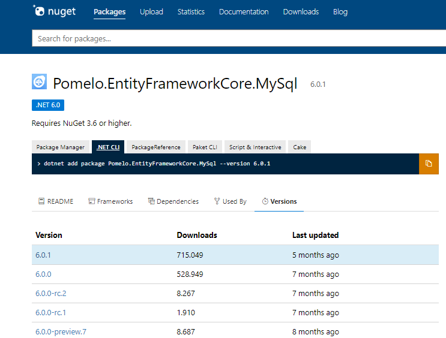
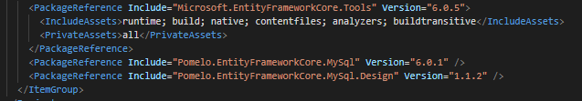
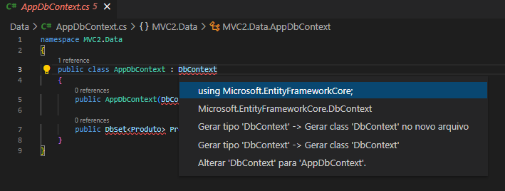
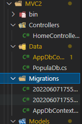
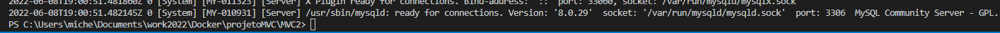
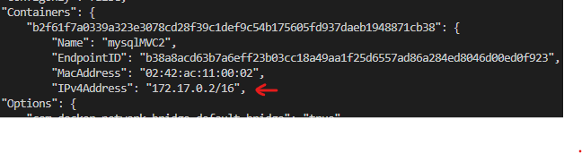
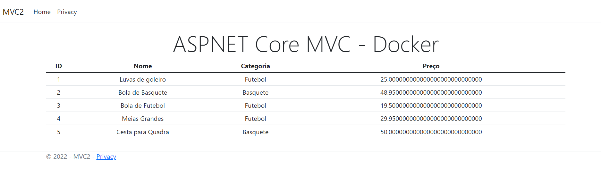
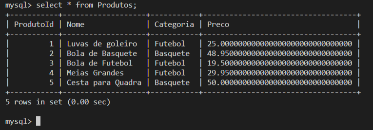

## Projeto MVC + MySQL, 2 contêineres + volume
<br>

Neste projeto vamos alterar o projeto MVC1 para se conectar ao MySQL, também será criado um novo contêiner para o MySQL, vamos mapear um volume para armazenar os dados e conectar os 2 contêineres.

Este projeto é sequência do [MVC1](../MVC1/readme.md), você pode consultar a primeira parte no readme.md do mesmo. 

- Recomendo que você siga as instruções abaixo seguindo no Projeto MVC1. Basta utilizar a nomencaltura MVC1, onde estiver MVC2.

- Caso queria fazer o MVC2, copie a pasta MVC1, cole no diretório projetoMVC e renomeie para MVC2. Na sequência utilize o search (Ctrl+Shif+F) **no diretório MVC2**, procure pelo termo MVC1 e substitua todos os resultados por MVC2. 

**Versão utilizada** - .Net 6.0

----

## Sumário
<br>

----

## Incluir os pacotes para MySQL e EF Core
<br>

Os pacotes abaixo devem ser incluídos no projeto MVC, lembre-se de usar os comando sempre no diretório de seu projeto. No caso deste projeto, projetoMVC > MVC2

1. Pomelo.EntityFrameworkCore.MySql  `(provedor para o MySQL)`;
2. Pomelo.EntityFrameworkCore.MySql.Design  `(permite acesso aos comandos dotnet ef)`;
3. Microsoft.EntityFrameWorkCore.Tools `(permite acessar as ferramentas do console de gerenciador de pacotes)`.

Os pacote podem ser adicionados usando o comando abaixo:

    dotnet add package <nome_do_pacote_versão>

ou

Você pode baixar a extensão *Nuget Gallery* ou *NuGet Package Manager* no VS Code e pesquisar pelas extensões.

[**Site do NuGet**](https://www.nuget.org/) - use para consultar versões etc.

Veja que o site já traz o comando para instalar o pacote pela CLI. **Procure sempre por versões compatíveis com seu projeto**.

<center>



</center>

Após adicionar os pacotes, verifique se eles aparecem no MVC2.csproj, conforme imagem abaixo:

<br>

<center>



</center>

>**Atenção com as versões utilizadas** - Elas podem conter pequenas diferenças entre si, se utilizadas inadequadamente podem causar erros em seu projeto.

----

## Criar arquivo de contexto
<br>

No diretorio projetoMVC > MVC2, vamos criar a pasta Data e nela criar a classe AppDbContext.cs, com o seguinte conteúdo:

```c#
public class AppDbContext : DbContext //herda de DbContext
    {
        public AppDbContext(DbContextOptions<AppDbContext> options) : base(options) {}

        // mapeamento entre a tabela MySql e entidade Produto.cs
        public DbSet<Produto> Produtos {get; set; } 
    }
```

- Uma instãncia `DbContext` representa uma sessão com o banco de dados usada para consultar e salvar instâncias de suas entidades em um banco de dados;
- A propriedade `DbSet` faz o mapeamento entre a Entidade da aplicação e a tabela no MySQL.

**Obs.:** Não esqueça de fazer as referências. Clique sobre a palavra DbContext e aperte "Ctrl + . ", e selecione `using Microsoft...` conforme imagem abaixo:

<center>



</center>
  
---

## Criar a classe de repositório
<br>

Essa classe vai substituir a classe TesteRepository.cs, acessar os dados na tabela **Produtos** mapeada na classe de contexto **AppDbContext.cs** .

Crie a classe ProdutoRepository.cs no diretório Models, com o seguinte conteúdo:

```c#
public class ProdutoRepository : IRepository //implementa a interface IRepository
    {
        //injetando instância da classe de contexto
        private AppDbContext _context; 

        public ProdutoRepository(AppDbContext context)
        {
            _context = context;
        }

        //acessa a tabela produtos e retorna lista de produtos
        public IEnumerable<Produto> Produtos => _context.Produtos; 
    }
```

**Obs.:** Não esqueça de colcoar as referências do AppDbContext, da pasta MVC2.Data;

---

## Criar classe para popular banco de dados
<br>

Essa classe vai inserir alguns dados iniciais no Banco de Dados, na tabela Produtos.

Crie a classe estática PopulaDb.cs no diretório Data:

```c#
public static class PopulaDb
    {
        public static void CreateDBIfNotExists(IApplicationBuilder app)
        {
            // Cria o escopo do serviço 
            using (var scope = app.ApplicationServices.CreateScope())
            {
                var services = scope.ServiceProvider;
                try
                {
                    //Faz a referência ao contexto
                    var context = services.GetRequiredService<AppDbContext>();
                    PopulaDb.IncluiDadosDB(context);
                }
                catch (Exception ex)
                {
                    var logger = services.GetRequiredService<ILogger<Program>>();
                    logger.LogError(ex, "An error ocurred creating the DB");
                }
            }
        }

        public static void IncluiDadosDB(AppDbContext context)
        {
            System.Console.WriteLine("Aplicando Migrations...");

            //aplica as migrações pendentes, cria banco de dados e tabelas
            context.Database.Migrate(); 

            //se não existirem dados na tabela, inclui os produtos abaixo
            if(!context.Produtos.Any()) 
            {
                System.Console.WriteLine("Criando dados...");
                context.Produtos.AddRange(
                    new Produto("Luvas de goleiro", "Futebol", 25),
                    new Produto("Bola de Basquete", "Basquete", 48.95m),
                    new Produto("Bola de Futebol", "Futebol", 19.50m),
                    new Produto("Meias Grandes", "Futebol", 29.95m),
                    new Produto("Cesta para Quadra", "Basquete", 50)
                );

                //persistir/salvar os dados acima na tabela Produtos
                context.SaveChanges(); 
            }
            else
            {
                System.Console.WriteLine("Dados já existem...");
            }
        }
    }
```
-----
## Configurar appsettings.json
<br>

No arquivo appsettings.json , adicionar as seguintes linhas:

```json
{
    //adicionar estas 2 linhas abaixo, essa é a string de conexão
  "ConnectionStrings": {
    "DefaultConnection": "server=localhost;port=3306;database=produtosdb;uid=root;password=root"
  },

  ...
}
```
A string de conexão possui as informações para conectar ao MySQL, você talvez precise substituir as informações da linha "DefaultConnection" conforme necessidade:

`database=`  aqui você deve inserir o nome do banco de dados que será criado;
`uid=` aqui você deve definir o usuário do MySql
`password=` a senha para se conectar ao MySQL

----

## Configurando a Classe Startup.cs (.Net 5.0)
<br>

1. Na classe Startup, ConfigureServices() substitua o TesteRepository por ProdutoRepository;
2. Configurar a string de conexão do MySql:

```c#
public void ConfigureServices(IServiceCollection services)
{
    ...
    //string de conexão
    string ConnectionString = builder
        .Configuration
        .GetConnectionString("DefaultConnection");

    //Serviço para conectar o contexto ao MySql
    services.AddDbContext<AppDbContext>(options =>
        options.UseMySql(ConnectionString, ServerVersion.AutoDetect(ConnectionString)));

    //feita substituição de teste Repository por ProdutoRepository
    services.AddTransient<IRepository, ProdutoRepository>(); 

    ...
}
```

3. Adicionar o PopulaDb no Configure():
   
**Recomendo ler o artigo abaixo**, na seção "Inicializar o BD com os dados de teste"

https://docs.microsoft.com/pt-br/aspnet/core/data/ef-mvc/intro?view=aspnetcore-5.0

Neste artigo a classe DbInitializer.cs seria nossa classe PopulaDb.cs, ele contém informações de como popular o banco e as alterações necessárias no Program.cs do .Net 5.0 **que não estão atualizadas aqui**.

> **Leia atentamente sobre o método EnsureCreated( ) ;**

```c#
//Orientações não estão atualizadas para .Net 5.0, provavelmente não funcione.
//Siga as instruções do artigo acima.

public void Configure(IApplicationBuilder app, IHostingEnvironment env)
{
    ...

    PopulaDb.CreateDBIfNotExists(app); //incluir esta linha

    ...
}
```
----

## Configurando a classe Program.cs (.Net 6.0)
<br>

1. Na classe Program.cs, substituir TesteRepository por ProdutoRepository;
2. Configurar o MySQL:

```c#
...

// Add services to the container.
builder.Services.AddControllersWithViews();

//string de conexão
string ConnectionString = builder
    .Configuration
    .GetConnectionString("DefaultConnection");

//Serviço para conectar o contexto ao MySql
builder.Services.AddDbContext<AppDbContext>(options =>
        options.UseMySql(ConnectionString, ServerVersion.AutoDetect(ConnectionString)));

// susbtiituição do Teste Reposiitory por ProdutoRepository
builder.Services.AddTransient<IRepository, ProdutoRepository>();

...
```

3.  Adicionar o PopulaDb no Configure HTTP, conforme exemplo abaixo:

```c#
// Configure the HTTP request pipeline.
...

app.UseStaticFiles();

PopulaDb.CreateDBIfNotExists(app); //inserir essa linha

...
```

---

## Criar script de migração
<br>

Vamos usar o comando abaixo para gerar o script que cria o Banco de Dados e a tabela Produtos da aplicação. Pode colocar o nome da migração como "Inicial".

    dotnet ef migrations add <nome_da_migração>

Esse comando vai criar uma migração pendente, que será aplicada pelo comando `context.Database.Migrate()` que definimosno método `IncluiDadosDB()` na classe PopulaDb.cs .

Se tudo ocorrer bem, aparecerá no terminal a mensagem "Done. To undo this action, use 'ef migrations remove' " e a pasta Migrations será criada no projeto.

<center>



</center>

----
## Criar o Contêiner com MySQL
<br>

1. Baixar a imagem do MySQL 8.0:

        docker image pull mysql:8.0

2. Inspecionar a imagem e verificar o local onde o MySql armazena os arquivos de dados:

        docker image inspect mysql:8.0

    diretório: `var/lib/mysql`

3. Criar volume:
    
        docker volume create --name mvc2

4. Criar o contêiner a partir da imagem do mysql:

        docker container run -d --name mysqlMVC2 -v mvc2:/var/lib/mysql -e MYSQL_ROOT_PASSWORD=root -e bind-address=0.0.0.0 mysql:8.0

    Relembrando:

    `-d ` - executa o contêiner em 2º plano;
    
    `-v mvc2:/var/lib/mysql` - faz o mapeamento entre o volume criado e o diretorio onde o mysql armazena os dados;

    `--name` - atribuir nome ao contêiner;

    `-e MYSQL_ROOT_PASSWORD` - atribuir senha ao mysql;

    `-e bind-address` - assegure que o mysql aceite requisições de todas as interfaces de rede.

5. Verificar o contêiner:

        docker container logs mysqlMVC2

    Se tudo ocorrer bem, a última linha vai mostrar que o contêiner está pronto para receber conexões.



----

## Criar imagem do MVC2
<br>

>**Obs.:** Vá até o arquivo appsettings.json, e na string de conexão "DefaultConnection" substitua o server=localhost por server=172.17.0.2 .Faça isso antes do dotnet publish.
>
>No passo seguinte você verá como identificar o IP de um contêiner. Esse ajuste está sendo feito porque **o curso que segui não conectava no contêiner do MySQL**. 

1. Publicar a a aplicação MVC (Se já houver uma pasta dist, pode deleta-la):

        dotnet publish --configuration Release --output dist

2. Criar a imagem da aplicação usando o Dockerfile (o mesmo do MVC1, atualizando a versão no LABEL, e se tiver criado o projeto MVC2, usar MVC2.dll):
   
        docker build -t mvc2:2.0 .

3. Você pode utilizar o comando abaixo para verificar se a imagem foi criada corretamente:

        docker images

----

## Criar contêiner com a imagem mvc2 e conectar ao contêiner mysqlMVC2
<br>

Os contêineres serão conectados por uma *Rede Definida por Software*(SDN) ou rede virtual.

Quando você cria um contêiner Docker, ele é conectado a uma **rede virtual interna** e é atribuído um **endereço de IP** ao contêiner, para que este possa se comunicar com o servidor host e com outros contêineres.

<br>

Para verificar o número de IP de um contêiner use o comando abaixo e procure por **"Containers"**:

    docker network inspect bridge

<center>



</center>

Esse número de IP é o que usaremos para conectar ao banco de dados no MySQL através da variável de ambiente `DBHOST`.

**Criando o contêiner:**

    docker container run -d --name appMVC2 -p 3000:80 -e DBHOST=172.17.0.2 -e DBPORT=3306 mvc2:2.0


Relembrando:

`-p` - a porta que será utilizada para acessar a aplicação no contêiner;

`-e DBHOST` - Inserir o IP do contêiner com banco de dados MySQL;

`-e DBPORT` - Inserir a porta padrão do MySQL;

Na sequência acesse http://localhost:3000/ para ver a aplicação MVC funcionando com os dados populados.

<center>



</center>

>**Atenção**: Se na string de conexão "DefaultConnection" no appsettings.json, você inseriu server=172.17.0.2 ou outro número de IP criado pelo docker, também é possível fazer da maneira abaixo:
> 
> Na classe Program.cs: 
>
>```c#
>...
>// Add services to the container.
>builder.Services.AddControllersWithViews();
>
>//insira a linha abaixo:
>var host = builder.Configuration["DBHOST"] ?? "localhost"; 
>
>// Altere a ConnectionString, igual foi feito abaixo: 
>string ConnectionString = $"server={host};port=3306;database=produtosdb;uid=root;password=root";
>...
>```
> Com essas alterações o server será sempre localhost possibilitando criar a migração, e vai aceitar o valor DBHOST da variável de ambiente com o número de IP, quando for passado pela CLI ao criar o contêiner. Nesse caso não é necessário passar a string de conexão no appsettings.json .

Você pode abrir um terminal no contêiner do MySQL e verificar se a tabela realmente foi criada. use a sequência de comandos abaixo:

    docker container exec -it mysqlMVC2 bash
    mysql -uroot -p
    root
    show databases;
    use produtosdb
    show tables;
    select * from Produtos;

<center>



</center>

----