## 1. Docker
<br>
...

----
## 2. Sumário

- [1. Docker](#1-docker)
- [2. Sumário](#2-sumário)
- [- Otimizar o Dockerfile](#--otimizar-o-dockerfile)
- [3. Completar.](#3-completar)
- [4. Imagens](#4-imagens)
  - [4.1. Como criar imagens?](#41-como-criar-imagens)
    - [4.1.1. Criando Imagens Docker](#411-criando-imagens-docker)
  - [4.2. Comandos](#42-comandos)
  - [4.3. Projeto MVC](#43-projeto-mvc)
- [5. Volumes](#5-volumes)
  - [5.1. Principais usos](#51-principais-usos)
  - [5.2. Criar volumes (mapeando pastas)](#52-criar-volumes-mapeando-pastas)
  - [5.3. Criar volume (volume create)](#53-criar-volume-volume-create)
  - [5.4. Projeto MVC2](#54-projeto-mvc2)
- [6. Redes no Docker](#6-redes-no-docker)
  - [6.1. Criar uma rede virtual no Docker](#61-criar-uma-rede-virtual-no-docker)
  - [6.2. Conectar 2 contêineres MVC ao contêiner MySQL](#62-conectar-2-contêineres-mvc-ao-contêiner-mysql)
  - [6.3. Limitações da Rede Padrão (bridge)](#63-limitações-da-rede-padrão-bridge)
  - [6.4. Balanceador de Carga](#64-balanceador-de-carga)
- [7. Docker Compose](#7-docker-compose)
- [Deploy no Contêiner](#deploy-no-contêiner)
- [Otimizar o Dockerfile](#otimizar-o-dockerfile)
----
## 3. Completar.
<br>
...

----

## 4. Imagens 
<br>

- Os contêineres do Docker são baseados em **imagens do Docker**;
- **Um contêiner sempre começa com uma imagem** e é considerado uma instanciação dessa imagem;
- A imagem seria **a classe** e o contêiner **os objetos da classe**;
- Toda Imagem é composta de uma ou mais camadas **somente leitura**, em um sistema chamado de **"Lyered File System"**;
- Todas as camadas formam a imagem e uma vez criada, a imagem **nunca é modificada**;
<br>
<br>
<center>

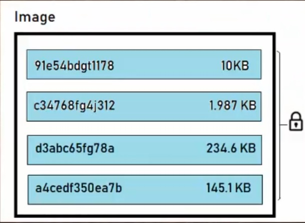

</center>
<br>
<br>

- As camadas podem ser reaproveitadas em outras imagens sendo assim compartilhadas;
  >O reaproveitamento de imagens diminui o consumo de banda (ficar baixando imagens repetidas) e espaço, pelo reaproveitamento das imagens.

<br>
<center>


</center>
<br>
<br>

- Quando criamos um contêiner, o Docker cria uma nova camada acima da última camada da imagem, e nessa podemos ler e escrever (**Read/Write Layer**);
  
<br>
<center>


</center>
<br>

- Usando uma **imagem** base, podemos reaproveitá-la para criar diversos contêiners diferentes compartilhando os componentes básicos. Isso ajuda a **otimizar espaço de armazenamento** e **minimizar o tempo de início** do contêiner;
  
  <br>

>  Uma imagem do Docker é um binário que inclui todos os requisitos para **a criação e execução** de um **único container do Docker**, bem como metadados que descrevem suas necessidades e capacidades, incluindo código do aplicativo dentro do contêiner e suas configurações;
> 
<br>

----

### 4.1. Como criar imagens?

  1. Processo de build usando **Dockerfile**
   
        O Dockerfile é um arquivo de texto com instruções, comandos e passos que é executado através do comando **build** para gerar uma imagem.

            docker build -t <imagem> //exemplo do comando
        
  2. Usando o comando commit (**não aderente as boas práticas, não deixa registro de como a imagem foi gerada**)
   <br>
   <br>

---

#### 4.1.1. Criando Imagens Docker
<br>

O Docker constrói **imagens** automaticamente lendo as instruções a partir de um arquivo de texto chamado **Dockerfile**.

O Dockerfile contém todos os comandos em ordem necessários para criar uma imagem. É neste arquivo que definimos todas as regras, informações e instruções que estarão contidas nas imagens.


Esse processo é conhecido como **build**.

    Ex.: Criar uma imagem a partir do debian 8 que instale e inicie o servidor nginx

    Etapas

    1. Definir uma imagem base;
    2. Definir informações para imagem
    3. Executar comandos para instalar e iniciar o nginx
    4. Expor qual porta o servidor vai atender (no container)
    5. Definir o ponto de entrada da aplicação
    6. Definir a execução de um comando para inicializar o servidor nginx


1 - Crie um arquivo chamado **Dockerfile**, esse arquivo **não possui extensão**, como .txt, por exemplo;
<center>

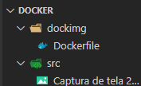

</center>

2 - Neste arquivo digite o seguinte conteúdo:

```Dockerfile
FROM debian:8 #definir imagem base
LABEL VERSION="1.0" description="Debian/Nginx" #informações para a imagem
RUN apt-get update && apt-get install -y nginx && apt-get clean #atualizar, instalar (flag -y para confirmar) e limpar os pacotes;
EXPOSE 80 #expor a porta de entrada que o nginx vai atender
ENTRYPOINT ["/usr/sbin/nginx"] #define o caminho, ponto de entrada da aplicação
CMD ["-g","daemon off;"] #comandos a serem executados
```

3 - Utilizar na CLI o seguinte comando:

    docker build -t teste/img:1.0 .

> Obs.: A flag " -t " é para informar o nome da imagem. O " . " no fim do comando representa a pasta atual (local).

<br>

4 - Se tudo der certo, será possível ver a imagem criada utilizando o comando `docker images`.

<br>
<center>

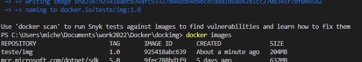

</center>

5 - Se quiser testar a imagem criada utilize o comando abaixo, aguarde a inicialização do container e acesse http://localhost:8080

    docker container run -d -p 8080:80 --name=ws1 teste/img:1.0

6 - Caso queira publicar sua imagem em um repositório utilize os comando abaixo na CLI:

    docker login //faz a autenticação na sua conta
    docker push <nome_imagem> //assim como no github envia a imagem para o repositório remoto no docker. No texto "nome_imagem", substitua pelo nome da sua imagem.

---

### 4.2. Comandos

- docker image --help //exibe os comandos disponíveis
- docker images //exibe repositório de imagens local (na sua máquina);
- docker image ls //exibe repositório de imagens local (na sua máquina);
- docker image pull \<nome da imagem> //baixa uma imagem ex: docker image pull nginx;
  >nginx é uma imagem de um servidor HTTP e proxy reverso.
- docker image pull \<nome da imagem:0.0> // idem ao item anterior, mas no lugar do 0.0 colocar a versão/tag correspondente, ex.: docker image pull mcr.microsoft.com/dotnet/sdk:5.0;
- docker image inspect \<nome da imagem:0.0> //exibe diversas informações referente a imagem;
- docker image history \<nome da imagem:0.0> //exibe o histórico da imagem;
- docker image tag \<imagemfonte:latest> \<imagemfonte:minhaTag> //cria uma referência para uma imagem existente, no caso latest é a última versão de uma imagem.
- docker image build Dockerfile //cria uma imagem a partir do docker file;
- docker image prune //remove todas as imagens;
- docker image rm \<Image_Id> //remove uma imagem pelo seu id. Passar somente os 4 primeiros caracteres;

---

### 4.3. Projeto MVC

Esse projeto será utilizado para criar uma imagem, e subir um container com a imagem do projeto.

Acesse o diretorio ProjetoMVC > MVC1 > [readme.md](projetoMVC/MVC1/readme.md)


---

## 5. Volumes
<br>

 - Volumes tornam possível excluir um contêiner sem excluir os dados que contém, permitindo que os contêineres sejam alterados ou atualizados sem perder dados e informações armazenadas;
 - Os volumes separam os arquivos de dados que são gerados por um aplicativo ou banco de dados do restante do contêiner;
 - Permite que dados importantes existam fora do contêiner.]

---

### 5.1. Principais usos
<br>

1. Manter dados quando um contêiner for removido;
2. Compartilhar dados entre o sistema de arquivos do host e o contêiner do Docker;
3. Compartilhar dados com outros contêineres do Docker.

----

### 5.2. Criar volumes (mapeando pastas)
<br>

Para criar um volume utilize o comando abaixo:

    docker container run -v <pasta_host>:<pasta_container> imagem

Ex.:

Criar um container usando a imagem alpine, no modo iterativo (-it), com nome alp1 (--name), no diretório Docker > Volume.

    docker container run -it --name alp1 -v $(pwd)/teste:/usr/share alpine

**obs.:** No windows use ${pwd}, com chaves. Se não souber o que pwd faz, digite em seu terminal. Ele vai mostrar o diretorrio atual.

Depois utilize a sequência de comandos abaixo para ir até a pasta /usr/share no alpine, criar um .txt e sair do terminal.

    ls
    cd usr
    cd share
    echo 'teste de volume' > teste.txt
    ls -g
    exit

<center>

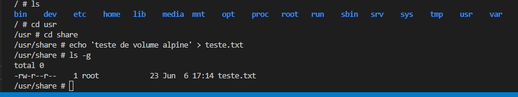

</center>

Na sequência verifique que o diretorio /teste foi criado e o arquivo teste.txt está dentro dele.

<center>

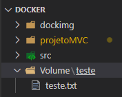

</center>

Se quiser você pode usar o inspect e verificar em Mounts o mapeamento feito (mostra os diretórios /teste:usr/share):

    docker container inspect alp1

---

### 5.3. Criar volume (volume create)
<br>

O comando abaixo cria um novo volume que os caontêineres podem consumir e armazenar dados. Caso não seja especificado um nome, o Docker gera um aleatóriamente.

    docker volume create <nome>

Para verificar os volumes criados utilize o comando abaixo:

    docker volume ls

Ex.:

<center>

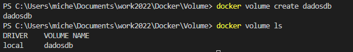

</center>

>**Agora vamos criar um container com uma imagem do mysql, criar um database e armazenar no volume. Na sequência deletar o primeiro container e criar outro, que vai acessar as modificações feitas e armazenadas no volume**

1. Utilize o comando abaixo para baixar a imagem do mysql:
   
        docker image pull mysql:5.7

2. Na sequência vamos inspecionar a imagem baixada:

        docker image inspect mysql:5.7

Aqui é necessário verificar a seção "Volumes" para ver qual diretorio o mysql armazena seus arquivos de dados, no caso `/var/lib/mysql`.

<center>

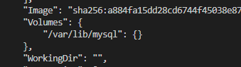

</center>

3. Criar contêiner com a imagem do mysql, executa-lo em background (-d), definir mapeamento de volume (-v) e definir senha root do mysql com uma variavel de ambiente (-e). 
   
   **Obs.** Para saber mais sobre as configurações do mysql acesse a [documentação da imagem](https://hub.docker.com/_/mysql) .

        docker container run -d --name mysql -v dadosdb:/var/lib/mysql -e MYSQL_ROOT_PASSWORD=senha123 mysql:5.7

4. Executar um terminal no container para fazer alterações no mysql

        docker container exec -it mysql /bin/bash

5. Acessar o mysql, inserir a senha, exibir banco de dados, criar banco de dados, exibir banco de dados, sair do mysql, sair do terminal do contêiner.
   
   Execute os comandos abaixo na sequência, linha por linha:

        mysql -u root -p
        senha123
        show databases;
        create database DockerTest
        show databases;
        exit;
        exit

**Obs.:** ao digitar a senha é normal não aparecer nada no terminal, normalmente esperamos que a cada caracter apareça um " * ". Só digite a senha correta e tecle Enter.

Imagem do banco de dados DockerTest criado:

<center>

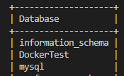

</center>

6. Parar e remover o contêiner do mysql:

        docker container stop mysql

        docker container rm mysql

Veja que não temos mais o contêiner mysql

<center>

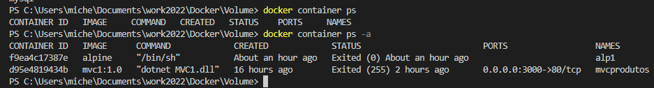

</center>

7. Criar o contêiner mysql2 com o mapeamento do volume em dadosdb:

        docker container run -d --name mysql2 -v dadosdb:/var/lib/mysql -e MYSQL_ROOT_PASSWORD=senha123 mysql:5.7 

8. Abrir um terminal no contêiner mysql2 e verificar a existência do Banco de Dados DockerTest
   
       docker container exec -it mysql2 /bin/bash
       mysql -u root -p
       senha123
       show databases;

Verifique que o DockerTest está na lista de banco de dados, ou seja, não foi deletado junto ao contêiner mysql.

---

### 5.4. Projeto MVC2
<br>

- Projeto de um contêiner com uma imagem MVC que se conecta a um contêiner com uma imagem MySQL e persiste os dados no MySQL e em um volume criado.
- Esse projeto é uma continuação do MVC1, podendo ser feito na própria pasta do MVC1.
- Aqui foi divido em outra pasta chamado MVC2, deixando o readme menor, somente com as alterações necessárias.

Diretório:

projetoMVC > MVC2 > [readme.md](projetoMVC/MVC2/readme.md)

----

## 6. Redes no Docker
<br>

O Docker trabalha com redes virtuais, que são uma simulação de redes físicas. No projeto MVC2, nós conectamos uma contêiner com uma aplicação a um contêiner com banco de dados através de sua rede virtual

<center>

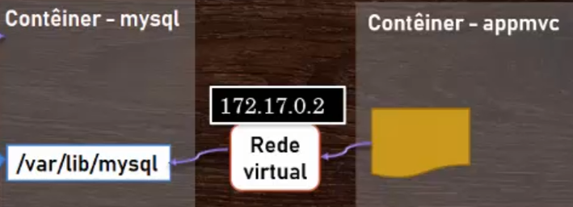

</center>

- Por padrão o Docker é disponibilizado com 3 redes, com configurações específicas para gerenciar o tráfego de dados.
  
  Utilize o comando abaixo para verificar as redes:

      docker network ls

- Host - rede do servidor host;
- None - sem conectividade, pode ser usada para isolar os contêineres;
- Bridge - Rede padrão onde os contêineres criados são inseridos.
  
  Todos os contêineres na rede bridge podem se conectar pelo protocolo TCP/IP, para consultar o IP de um contêiner utilize o comando abaixo, e procure pela informação "Containers":

      docker network inspect bridge

<center>

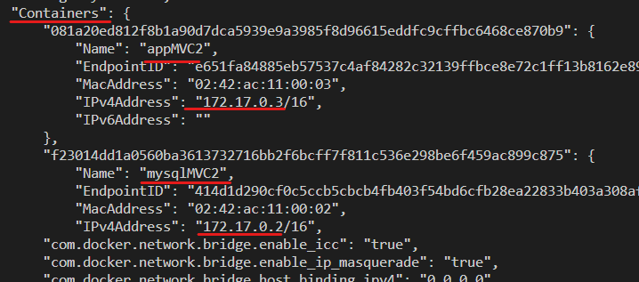

</center>

-----
### 6.1. Criar uma rede virtual no Docker
<br>

O docker também permite criar uma rede virtual customizada, através do comando:

    docker network create -d <nome> <nome_da_rede>

Obs.: Caso não seja informado o `-d`, o docker usará o bridge por padrão.

Ex.: 

1. Criar rede customizada:
  
        docker network create -d bridge redealpine

2. Criar o contêiner alp1:
   
        docker container run -it --name alp1 --network redealpine alpine

`--network` - informa qual rede o container usuará.

Digite hostname -i, no modo iterativo (-it abre um terminal), para ver o IP do contêiner. 

3. Abra outro terminal para criar o contêiner alp2:
   
        docker container run -it --name alp2 --network redealpine alpine

    Verifique o IP deste contêiner com o hostname -i;

4. Verificar a conexão entre os 2 contêineres:
   
   No terminal do alp2 digite ping alp1

   Verifique que é feito a troca de dados entre os contêineres dentro da rede. Aperte Ctrl + C para interromper o compando ping.

>Obs. Na **rede padrão** do docker a comunicação só é possível **através do IP**.  Já **na rede customizada**, é possível usar **o nome do contêiner como um hostname** para ter acesso ao mesmo.

5. Abra outro terminal para criar um contêiner alp3 

        docker container run -it --name alp3 alpine

    Esse contêiner ficará fora da rede redealpine

6. Libere o terminal do alp1:

    Dê um "exit" para liberar o terminal e utiliza-lo.

    Vamos conectar o alp3 a rede redealpine, ele ficará conectado as 2 redes:

        docker network connect redealpine alp3

7. Inspecione as redes e os contêineres alp2 e alp3:

      Use o comando `docker network inspect <nome_da_rede>` e `docker container inspect <nome_do_container> ` para ver em quais redes estão conectados, seus IPs, etc.

----

### 6.2. Conectar 2 contêineres MVC ao contêiner MySQL
<br>

  Aqui copiei o projeto MVC2 e somente alterei o nome para MVC3, criei a imagem e usei a porta 3500, para conectar ambos os contêineres no contêiners do MySQL.

      docker container run -d --name appMVC3 -p 3500:80 -e DBHOST=172.17.0.2 -e DBPORT=3306 mvc3:2.0

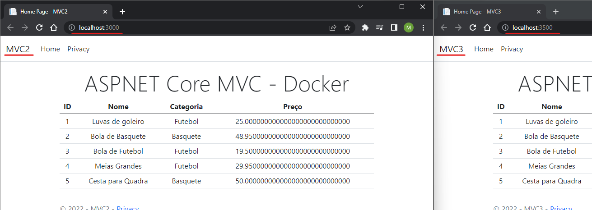

 O procedimento é o mesmo utilizado para conectar o MVC2 ao contêiner do MySQL, só utilizamos uma outra porta. Isso possibilita escalar a aplicação.   

 O fluxo de comunicação pode ser visto abaixo:

 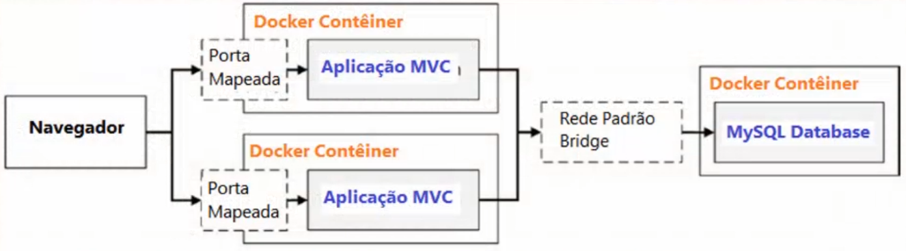

 ----

### 6.3. Limitações da Rede Padrão (bridge)
<br>
  A rede padrão do Docker possui as seguintes limitações:

  1. Ter que inspecionar a rede para obter o número de IP e conectar os contêineres, devido a impossibilidade de conectar-se pelo nome do contêiner;
  2. Todos os contêineres ficam limitados a mesma rede, enquanto aplicações normalmente são projetadas para múltiplas redes.

> Com as redes personalizadas, é possível criar uma rede "frontend" e uma rede "backend", por exemplo, testando a conexão das aplicações MVC2 e MySQL em redes diferentes. Da mesma forma que foi feito com o alp2 e alp3.

----

### 6.4. Balanceador de Carga
<br>

O balanceador de carga tem a tarefa de dividir o tráfego para diferentes servidores evitando a sobrecarga, quando há muitos acessos.

Aqui vamos criar as redes frontend e backend, com 3 contêineres MVC, 1 contêiner MySQL e usar o [haproxy](https://hub.docker.com/_/haproxy) para fazer o balanceamento de carga. 

**Importante** - aqui é necessário usar a variável host, passando o DBPORT conforme feito no projeto MVC2, na classe Program.cs, na imagem MVC. Neste exemplo eu criei as imagens do mvc3, mvc4 e mvc5.

```c#
var host = builder.Configuration["DBHOST"] ?? "localhost";
string ConnectionString = $"server={host};port=3306;database=produtosdb;uid=root;password=root";

```

1. Criando as redes:

        docker network create -d bridge frontend
        docker network create -d bridge backend

2. Criar o contêiner MySql na rede *backend*:
   
        docker container run -d --name mysql -v mvc2:/var/lib/mysql --network=backend -e MYSQL_ROOT_PASSWORD=root -e bind-address=0.0.0.0 mysql:8.0

3. Criar os contêineres MVC na rede *frontend*

        docker container create --name mvcapp1 -e DBHOST=mysql --network backend mvc3:1.0
        docker container create --name mvcapp2 -e DBHOST=mysql --network backend mvc4:1.0
        docker container create --name mvcapp3 -e DBHOST=mysql --network backend mvc5:1.0

        docker network connect frontend mvcapp1
        docker network connect frontend mvcapp2 
        docker network connect frontend mvcapp3

        docker container start mvcapp1 mvcapp2 mvcapp3

4. Cofigurando o haproxy:

  Escolha um diretório e crie um arquivo chamado "haproxy.cfg", lembre-se de usar esse diretório ao informar o volume quando criar o container do haproxy, pois ele vai passar as informações para a imagem. Este arquivo deve conter o conteúdo abaixo:

        defaults
            timeout connect 5000
            timeout client 50000
            timeout server 50000
 
        frontend localnodes
            bind *:80
            mode http
            default_backend mvc
 
        backend mvc
            mode http
            balance roundrobin
            server mvc1 mvcapp1:80
            server mvc2 mvcapp2:80
            server mvc3 mvcapp3:80


5. criar o contêiner do balanceador de carga (load balancer) haproxy na rede *frontend*:
   
        docker container run -d --name loadbalancer --network frontend -v "${pwd}/haproxy.cfg:/usr/local/etc/haproxy/haproxy.cfg" -p 3200:80 haproxy:1.7.0

    Para acessar a aplicação http://localhost:3200/

    Ao abrir a aplicação em abas diferentes ou atualizar a página, veja que, apesar de usar sempre a porta 3200 o haproxy redireciona para um container diferente, cada vez que o endereço é acessado. Caso você desative um dos contêiners ele redireciona para outro, mantendo a aplicação em funcionamento.

<center>

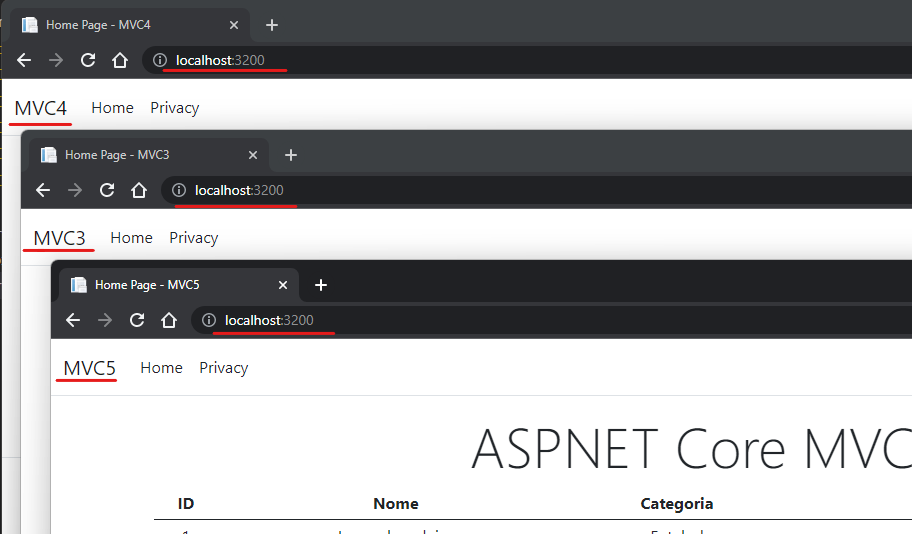

</center>

----

## 7. Docker Compose

O Docker Compose é uma ferramenta usada para descrever aplicações complexas e gerenciar os contêineres, redes e volumes que essas aplicações exigem para funcionar.

Simplifica o processo de configuração e execução de aplicativos para que você não precise digitar comandos complexos, que poderiam levar a erros de configuração.

Faz isso através de um arquivo.yml.

[Instalar o docker Compose (Linux)](https://docs.docker.com/compose/install/). Se tiver instalado o Docker for Windows ele já vem com o Compose junto.

Este arquivo, é chamado de docker-compose.yml, e é divido em seções:

Seção| Descrição
---    | ---
version| Especifica a versão do esquema **Docker compose88 que o arquivo usa.
volumes| Usado para confiigurar Volumes que serão usados pelos contêiineres definidos para compor arquivo.
networks| Usado para configurar as redes que serão usadoas pelos contêineres.
services| Define os contêineres que serão utilizados (imagens, contextos...)


1. Crie um arquivo chamado docker-compose.yml;
2. Insira o código abaixo nele:

```docker-compose
version: "3"

volumes:
      produtosmvc:

networks:
      frontend:
      backend:

services:

      mysql:
        image: "mysql:8.0"
        volumes:
          - produtosmvc:/var/lib/mysql
        networks:
          - backend
        enviroment:
          - MYSQL_ROOT_PASSWORD=root
          -bind-address=0.0.0.0

      mvc:
        build:
          context: ./projetoMVC/MVC2 .
          dockerfile: Dockerfile
        networks:
          - backend
          - frontend
        ports:
          - 5000:80
        environment:
          - DBHOST=mysql
        depends_on:
          - mysql
```
**Atenção!** alguns diretórios podem ser diferentes, dependendo de onde você criou os arquivos.

3. Processar aquivo de composição e verificar a sintaxe:

        docker-compose build

4. Processar arquivo de composição e iniciar aplicação(`-d` para rodar em 2 plano, deixando o terminal livre):

        docker-compose up -d

5. Aguarde um pouco, e verifique os logs para ver se já é possível se conectar ao container MySQL e se o MVC está funcionando corretamente:

        docker-compose logs

6. Verifique se a tabela foi criada corretamente:

        docker container exec -it <nome_do_container_mysql> bash
        mysql -u root -p
        senha: root
        show databases;
        use produtosdb;
        show tables;
        select * from Produtos;

7. Acesse a aplicação no link http://localhost:5000/ para ver se tudo está funcionando.

8. Desfazer operação(se usar a flag -v exclui os volumes também):

        docker-compose down

----

## Deploy no Contêiner
<br>

Fazer o Deploy no contêiner nada mais é, que publicar a aplicação usando o próprio docker. Você não vai fazer manualmente o `dotnet publish`.

O primeiro passo é escolher a imagem base e seguir a sequência conforme imagem abaixo:

<center>

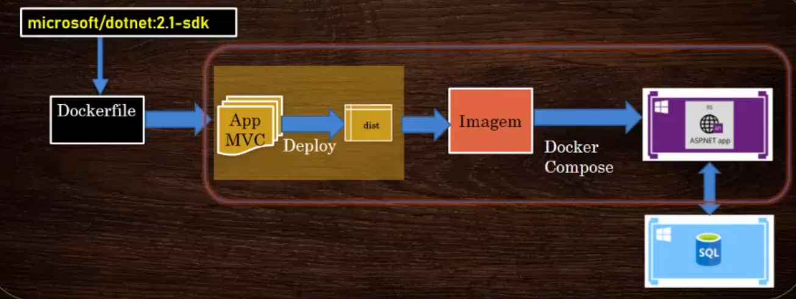

</center>

1. Criar o arquivo Dockerfile.dev, para distinguir do primeiro Dockerfile, com o seguinte conteúdo:

```Dockerfile
FROM mcr.microsoft.com/dotnet/sdk:6.0

RUN mkdir /app
WORKDIR /app
COPY MVC2.csproj .

RUN dotnet restore
COPY . .

RUN dotnet publish -c Release -o dist

EXPOSE 80/tcp

CMD ["dotnet","dist/MVC2.dll"]
```

2. Criar o arquivo docker-compose-dev.yml, alterando o dockerfile para Dockerfile.dev

```Dockerfile
dockerfile: Dockerfile.dev //alterar esta linha
```

3. Utilizar o comando `docker-compose -f <nome__do_arq_docker_compose> -p` (-f para indicar o arquivo, e -p para criar um prefixo no nome)

        docker-compose -f docker-compose-dev.yml -p dev up mvc

Obs.: 'mvc' faz referência ao container a ser levantado no docker-compose file.


----

## Otimizar o Dockerfile
<br>

- Suporte a multi-estágios (usar + de um comando FROM);
- Cada comando FROM é um novo estágio que substitui o anterior/ como se fosse uma nova imagem independente e isolada;
- Você pode nomear os estágios usando AS;
- O comando COPY --from, pode ser usado para copiar arquivos de um estágio, ou etapas anteriores.

1. Otimizando o Dockerfile.dev

```dockerfile
#Estagio1 - base

FROM mcr.microsoft.com/dotnet/aspnet:6.0 AS base
RUN mkdir /app
WORKDIR /app
EXPOSE 80/tcp

#Estagio2 - publish

FROM mcr.microsoft.com/dotnet/sdk:6.0 AS publish
WORKDIR /app
COPY MVC2.csproj .
RUN dotnet restore
COPY . .
RUN dotnet publish -c Release -o dist

#Estagio3 - final

FROM base AS final
WORKDIR /dist
COPY --from=publish /app/dist .
ENTRYPOINT [ "dotnet","MVC2.dll" ]
```

Veja que a imagem gerada é bem menor que usar apenas a imagem do aspnet:6.0;


